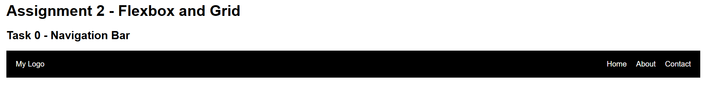
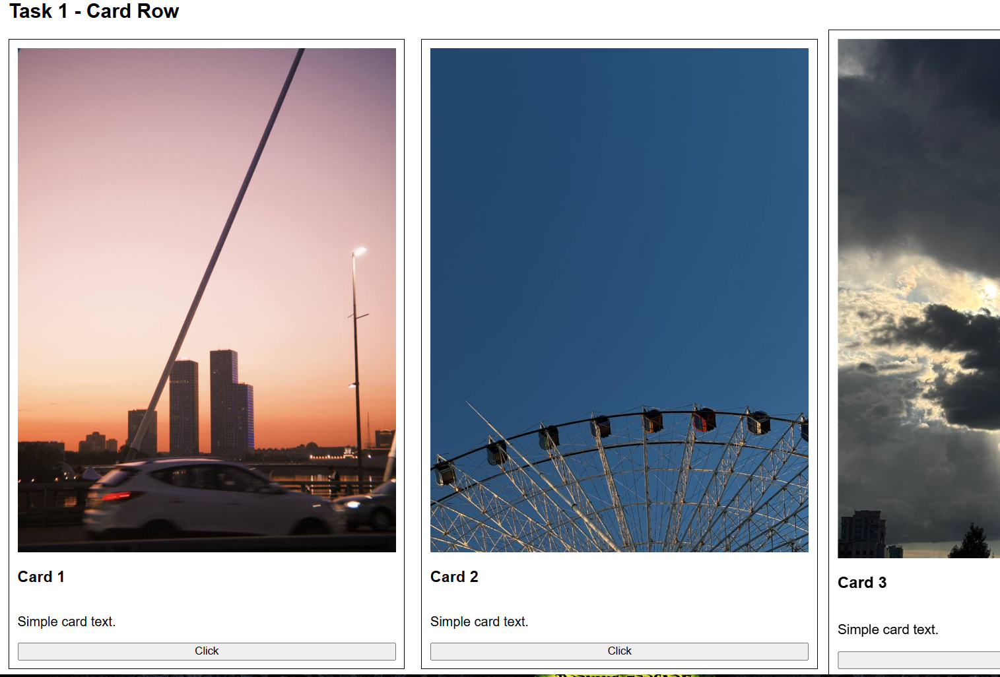
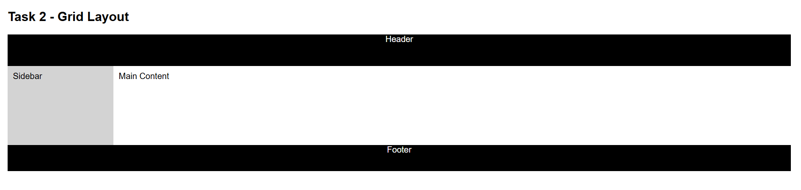
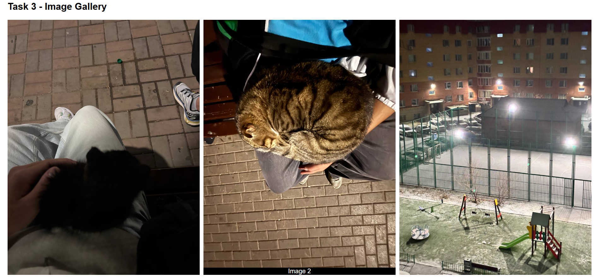
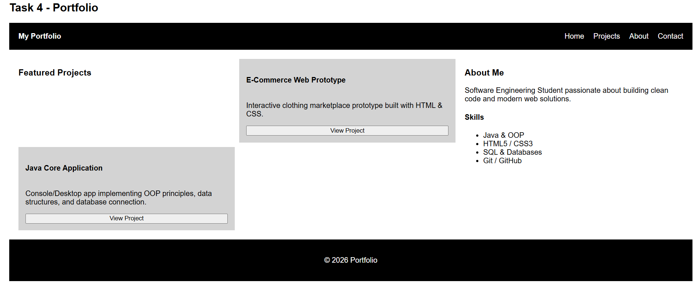

# Assignment 2 - Advanced CSS

**Name:** Alisher Yeskermes  
**Group:** IT-2501

## Task 0 - Navigation Bar

I created a navigation bar using Flexbox.
The logo is on the left and the navigation links are on the right.

## Task 1 - Card Row

I created three cards using Flexbox.
Each card contains an image, title, text and button.
I also added a hover effect.

## Task 2 - Page Layout

I created a page layout using CSS Grid.
The layout contains a header, sidebar, main content and footer.

## Task 3 - Image Gallery

I created a gallery with nine images using CSS Grid.
The gallery has three columns and a hover caption.

## Task 4 - Portfolio Page

I combined Flexbox and Grid to create a portfolio page.
Flexbox is used in the header and project cards.
Grid is used for the main portfolio layout.

## Summary
In this assignment, I implemented modern CSS layout techniques using **Flexbox** and **CSS Grid** to build responsive web components and structural layouts:

* **Task 0 (Navigation Bar):** Built a flexible header layout using Flexbox with space-between alignment and vertically centered elements.
* **Task 1 (Card Row):** Designed an equal-height product card row using Flexbox with smooth hover elevation effects (transform and box-shadow).
* **Task 2 (Grid Layout):** Structured a classic web page layout (Header, Sidebar, Main Content, Footer) using grid-template-areas.
* **Task 3 (Image Gallery):** Created a responsive 3x3 photo gallery using CSS Grid with animated caption overlays on hover.
* **Task 4 (Portfolio Page):** Combined Flexbox and CSS Grid to create a multi-section portfolio with a dynamic two-column content layout and flex-driven project cards.
